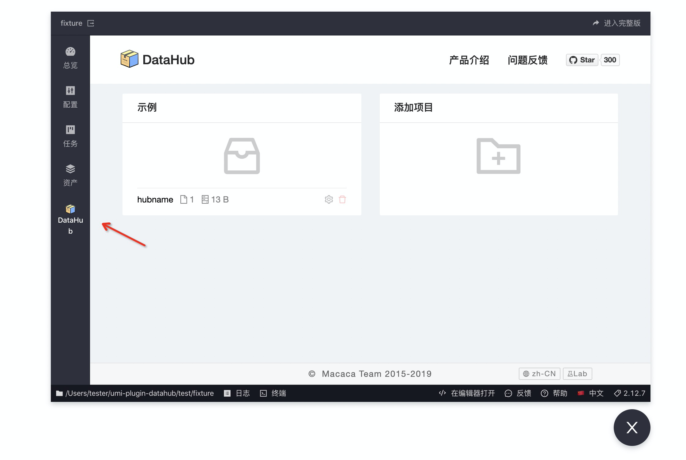
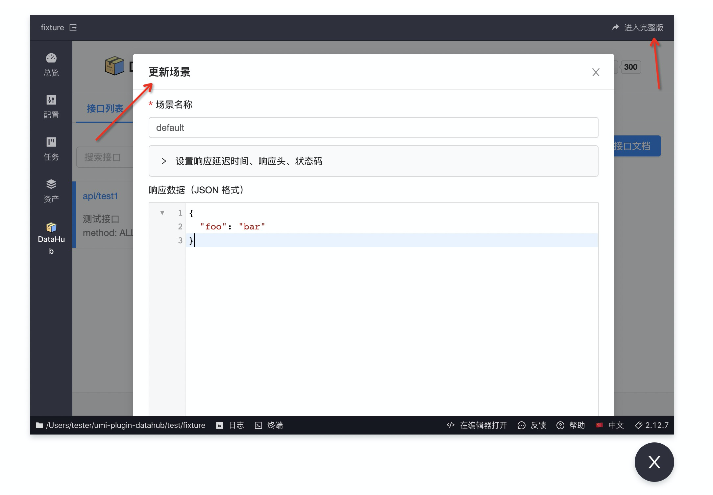

<p align="center">
  <a href="//macacajs.github.io/macaca-datahub">
    
  </a>
</p>

# umi-plugin-datahub

---

[中文版](./README.zh.md) | [Offical Site](//macacajs.github.io/macaca-datahub)

[![NPM version][npm-image]][npm-url]
[![build status][travis-image]][travis-url]
[![node version][node-image]][node-url]
[![umi version][umi-image]][umi-url]
[![npm download][download-image]][download-url]

[npm-image]: https://img.shields.io/npm/v/umi-plugin-datahub.svg?style=flat-square&logo=npm
[npm-url]: https://npmjs.org/package/umi-plugin-datahub
[travis-image]: https://img.shields.io/travis/umijs/umi-plugin-datahub.svg?style=flat-square&logo=travis
[travis-url]: https://travis-ci.org/umijs/umi-plugin-datahub
[node-image]: https://img.shields.io/badge/node.js-%3E=_8-green.svg?style=flat-square&logo=node.js
[node-url]: http://nodejs.org/download/
[umi-image]: https://img.shields.io/badge/umi-%3E=_3-green.svg?style=flat-square
[umi-url]: https://github.com/umijs/umi
[download-image]: https://img.shields.io/npm/dm/umi-plugin-datahub.svg?style=flat-square&logo=npm
[download-url]: https://npmjs.org/package/umi-plugin-datahub

umi plugin for integrating [macaca-datahub](//github.com/macacajs/macaca-datahub), which is a GUI-style mock tool that can be used to replace umi's built-in mock solution.

<div align="center">
  
</div>

<!-- GITCONTRIBUTOR_START -->

## Contributors

|[<br/><sub><b>xudafeng</b></sub>](https://github.com/xudafeng)<br/>|[<br/><sub><b>sorrycc</b></sub>](https://github.com/sorrycc)<br/>|[<br/><sub><b>PeachScript</b></sub>](https://github.com/PeachScript)<br/>|[<br/><sub><b>tudou527</b></sub>](https://github.com/tudou527)<br/>|[<br/><sub><b>ycjcl868</b></sub>](https://github.com/ycjcl868)<br/>|
| :---: | :---: | :---: | :---: | :---: |


This project follows the git-contributor [spec](https://github.com/xudafeng/git-contributor), auto updated at `Thu Jan 02 2020 22:11:29 GMT+0800`.

<!-- GITCONTRIBUTOR_END -->

## Setup

Install it via npm or yarn,

```bash
$ npm i umi-plugin-datahub -D
```
Umi will load this plugin automatically from `package.json`.

## Options

We can specify options for macaca-datahub, such as proxy and store.

```javascript
export default {
  datahub: {
    proxy: {
      '^/api': {
        hub: 'hubname',
      },
    },
    store: path.join(__dirname, 'data'),
  },
};
```

Checkout [macaca-datahub](//macacajs.github.io/macaca-datahub/guide/) for more options.

## Development

Debug Plugin

```bash
$ cd test/fixture
$ npm run dev
```

Debug UI

```bash
# watch build
$ npm run build -- -w
$ cd test/fixture
$ npm run dev:ui
```

<div align="center">
  
</div>

<div align="center">
  
</div>

## Example

- [umi-examples](//github.com/umijs/umi-examples/tree/master/eleme-demo)

## LICENSE

MIT
